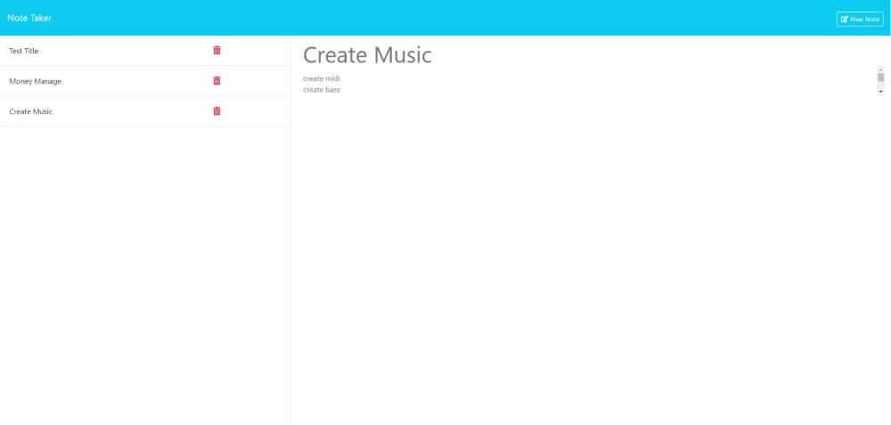

# Note-Taker

## Table of Contents
- [Description](#description)
- [Code Explanation](#code-explanation)
- [Dependencies](#dependencies)
- [Installation](#installation)
- [License](#license)

## Description
This is a simple Express.js application that serves as a note-taking app. It provides functionality to retrieve, add, and delete notes. The app uses an in-memory database stored in a JSON file. It also serves static HTML files for the homepage and notes page.
Installation
To run the application, follow these steps:
Clone the repository.

## Code Explanation
The code uses the Express.js framework to create a server and define various routes. It also interacts with the file system to read and write notes to a JSON file. The uuid package is used to generate unique IDs for the notes.
Error Handling
The application includes basic error handling for internal server errors. If an error occurs, the server responds with a 500 status code and an "Internal Server Error" message.

## Dependencies
The application uses the following dependencies:
express: For creating the web server and defining routes.
uuid: For generating unique IDs for notes.

## Installation
* Install the required dependencies using "npm install" in your intergrated terminal.
* To start server, run "node server.js" in your intrtgrated terminal.
* Visit http://localhost:3000/ in your browser.

## License
This project is licensed under the MIT License - see the LICENSE file for details.

## Scrrenshot
